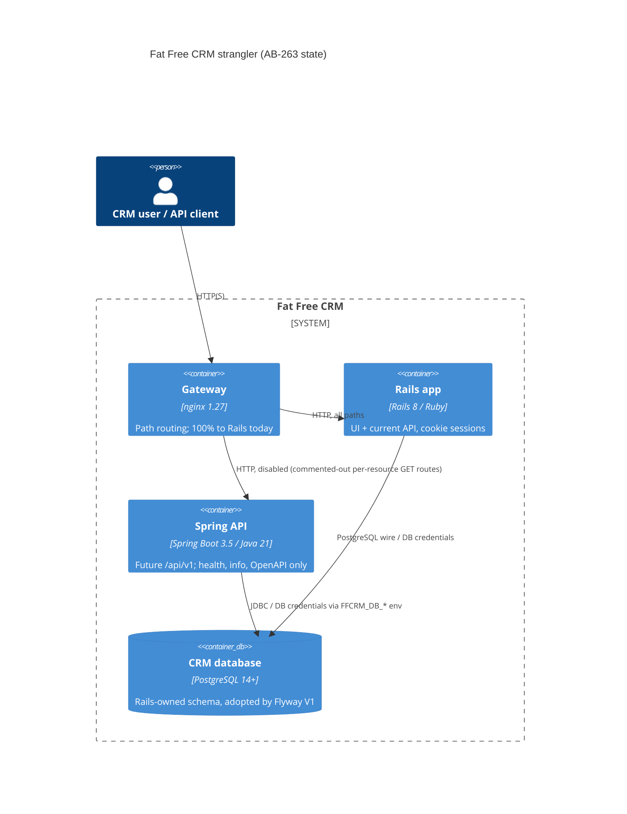

# 0001. Spring Boot API service skeleton alongside Rails (strangler)

- **Status:** Proposed
- **Date:** 2026-10-07
- **ARB ticket:** TO BE CREATED
- **Authors:** Devin (AB-263)
- **Owning team:** TBD — owner to confirm before ARB (Fat Free CRM migration team, epic AB-261)
- **Related ADRs:** Epic design docs `docs/migration/target-architecture.md`, `docs/migration/migration-plan.md`; Jira AB-261 / AB-263

## Context

Epic AB-261 migrates Fat Free CRM from Rails 8 to Spring Boot using the strangler pattern: both
applications run side by side against the **same PostgreSQL database** behind a path-routing
gateway until each resource is cut over. AB-263 (Phase 1) only stands up the landing zone: an
empty Spring Boot 3.5 / Java 21 service (`spring/`), a Flyway baseline that adopts the
Rails-owned schema, a frozen OpenAPI contract served by springdoc, a deny-by-default security
filter chain, RFC 9457 error handling, an nginx gateway that still routes 100% of traffic to Rails,
and CI. No business endpoints, entities, or authentication mechanism are added (AB-264..AB-267).

Constraints: Rails must keep working unchanged against the shared schema; Hibernate never writes
DDL (`ddl-auto: validate`); Flyway migrations are additive only; PostgreSQL 14 floor (16 in
tests/CI).

ARB triggers: T1 (new service/component: Spring API + nginx gateway), T4 (cross-domain
integration: Rails and Spring share one database schema), T6 (auth/network boundary: new gateway
in front of Rails, new service with its own security filter chain), T7 (new runtime/framework:
Java 21 + Spring Boot 3.5). T2/T3 flagged by the detector but not applicable: no new data store
(V1 adopts the existing Rails schema) and no new external vendor.

## Decision

We will add a single-module Spring Boot 3.5 service in `spring/` that connects to the existing
Rails PostgreSQL database, adopts its schema via Flyway (`baseline-on-migrate=true`,
`baseline-version=1`, so an existing Rails database is never re-created while an empty database
gets `V1__baseline_rails_schema.sql`), keeps Rails' `schema_migrations`/`ar_internal_metadata`
tables so both frameworks can share the database, denies every non-operational endpoint with
401 `application/problem+json` until AB-264 adds JWT auth, and place an nginx gateway in front of
Rails that routes nothing to Spring until a resource is explicitly cut over.

## Alternatives considered

| Alternative | Pros | Cons | Why rejected |
| --- | --- | --- | --- |
| Do nothing (stay on Rails) | No new runtime or ops burden | Epic goal (AB-261) not met | Migration already approved at epic level |
| Big-bang rewrite with a separate new database + data migration | Clean schema, no coexistence constraints | Long freeze, risky cutover, two sources of truth during sync | Strangler with shared DB allows per-resource cutover and one-line rollback |
| Separate DB per service with CDC/sync | Strong isolation | New data store + sync infra (more ARB triggers), consistency lag | Disproportionate for a monolith-to-monolith migration |
| Flyway re-creates schema / Hibernate `ddl-auto=update` | Simpler bootstrap | Would mutate or fight Rails-owned tables | Violates "Rails keeps working" constraint |
| Spring Cloud Gateway instead of nginx | Java-native, programmable | Another JVM service to run | nginx is config-only and enough for path/method routing |

## Architecture

## Non-functional requirements

| NFR | Target | How met |
| --- | --- | --- |
| Availability SLO | TBD — owner to confirm before ARB | Spring is off the request path until cutover; gateway adds one hop to Rails |
| p95 latency | TBD — owner to confirm before ARB | Gateway is a single nginx proxy hop |
| RPO / RTO | Unchanged (single shared database) | No new data store |
| Peak load | TBD — owner to confirm before ARB | No traffic routed to Spring in this phase |
| Scaling model | Stateless (sessions STATELESS); horizontal | Actuator liveness/readiness probes enabled |
| Data retention | Unchanged | No new data |

## Security & compliance

- **Data classification:** Unchanged — CRM data (contacts, leads, accounts) already in the Rails DB; Spring reads the same data in later phases.
- **Encryption at rest:** Unchanged (existing database configuration).
- **Encryption in transit:** TBD — gateway TLS termination to be decided for deployment; local compose is HTTP.
- **AuthN / AuthZ:** Deny-by-default `SecurityFilterChain`: only `/actuator/health/**`, `/actuator/info`, `/v3/api-docs/**`, `/swagger-ui/**`, `/openapi.yaml`, `/error` are public; everything else 401 problem+json (403 for denial). JWT auth arrives in AB-264. CSRF disabled because the API is stateless (no cookies).
- **Secrets:** DB credentials via `FFCRM_DB_URL/USER/PASSWORD` env vars; none committed.
- **Audit logging:** ECS structured JSON console logs; actuator health details hidden (`show-details: never`), env info disabled.
- **Data residency / regions:** Unchanged.
- **Policy sections satisfied:** No cloud infrastructure (no CDK/Terraform) in this change.
- **Threats considered:** Accidental exposure of unfinished endpoints (mitigated: deny-by-default + gateway routes nothing to Spring); schema damage to Rails tables (mitigated: Flyway baseline, `clean-disabled`, Hibernate `validate`); error-message leakage (mitigated: generic 500 detail).

## Cost

| Item | Assumption | Monthly estimate |
| --- | --- | --- |
| Spring API instance(s) | Deployment target not chosen | TBD — owner to confirm before ARB |
| Gateway (nginx) | Deployment target not chosen | TBD — owner to confirm before ARB |
| **Total** | | TBD |

## Operations

- **On-call rotation:** TBD — owner to confirm before ARB.
- **Runbook:** `spring/README.md` (build, run, gateway, baseline regeneration).
- **Dashboards / alarms:** Actuator `/actuator/health` (liveness/readiness); metrics/Prometheus deferred.
- **Rollback plan:** Gateway routes are commented-out blocks; rollback is re-commenting the resource block and `nginx -s reload`. Flyway only adds `flyway_schema_history` to an adopted DB.
- **Migration / cut-over plan:** Per resource (GET first) once the contract-diff harness (AB-266) is green for it; see `docs/migration/migration-plan.md`.

## Policy exceptions requested

| Rule | Resource | Justification | Compensating control | Expiry |
| --- | --- | --- | --- | --- |
| none | | | | |

## Consequences

- Positive: later tickets have a buildable, tested landing zone; schema ownership rules are enforced in code and CI (`spring-api.yml` checks the baseline matches what Rails generates from `db/schema.rb`).
- Negative / risks: two runtimes to operate during coexistence; any new Rails migration must be mirrored as an additive Flyway V2+ migration; `baseline-on-migrate` would also baseline a non-empty non-Rails database if misconfigured.
- Follow-ups: production `cf_*` custom-field columns (AB-262 dump, AB-267); JWT auth (AB-264); gateway TLS + deployment target; metrics endpoint exposure.

## Open questions

- Owning team, on-call, availability/latency targets and cost for the Spring service and gateway.
- Deployment target and TLS termination for the gateway.
