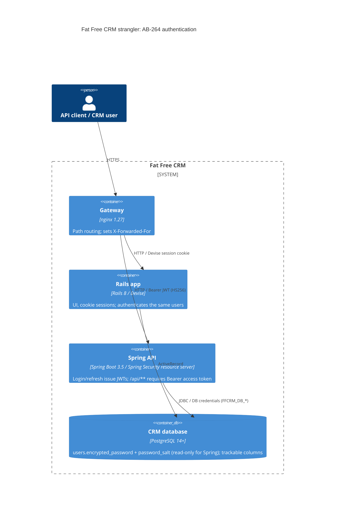

# AB-264. Stateless JWT authentication for `/api/v1` with legacy Devise password compatibility

- **Status:** Proposed
- **Date:** 2026-10-07
- **ARB ticket:** TO BE CREATED
- **Authors:** Devin (AB-264)
- **Owning team:** TBD, to be confirmed by the owner before ARB (Fat Free CRM migration team, epic AB-261)
- **Related ADRs:** `docs/adr/0001-spring-boot-api-service-skeleton.md` (AB-263),
  `docs/migration/decisions/0002-auth-model-and-ui-ownership.md` (API auth = stateless JWT),
  `docs/migration/target-architecture.md` §2.4; Jira AB-264, AB-268 (authorization), AB-274 (cutover)

## Context

Under the strangler plan, Rails 8 and the Spring Boot API share one PostgreSQL database.
Decision record 0002 picked stateless JWT access and refresh tokens for `/api/v1`. Rails keeps
Devise cookie sessions for the UI. The Spring service must authenticate the **same users with the
same stored credentials** that Rails uses, without changing anything Rails relies on.

Rails facts that constrain the design (verified from `app/models/users/user.rb`,
`config/initializers/devise.rb`, devise 5.0.3 and devise-encryptable 0.2.0 sources):

- Passwords use devise-encryptable `authlogic_sha512`. The digest starts as `password + password_salt`
  and is then hashed 20 times, each round being the lowercase-hex SHA-512 of the previous string
  (`config.stretches = 20` outside the test environment). There is no pepper. The salt is a separate
  column (`users.password_salt`).
- Login lookup: the sign-in form submits the login (username or email) as the `email` param, the
  Devise authentication key, so `strip_whitespace_keys`/`case_insensitive_keys = [:email]` strip and
  downcase the whole login. It is then matched with `lower(username) = ? OR lower(email) = ?`, and the
  first row by id wins.
- `active_for_authentication?` requires `confirmed_at` to be set and `suspended_at` to be null. It is
  checked on every request, not only at sign-in.
- Devise Trackable updates `sign_in_count`, `current/last_sign_in_at` and `current/last_sign_in_ip` (and
  `updated_at`) on a successful sign-in only. There is no lockable module, so failed logins write
  nothing.

The ticket also notes that if the hash scheme could not be reproduced, the fallback would be a forced
password reset campaign. It was reproduced: the committed fixture holds hashes created by the real
Rails `User` model, and they match byte for byte.

ARB triggers: **T6** (auth mechanism change: a new token-based authentication boundary for
`/api/v1`, a new `spring-boot-starter-oauth2-resource-server` / Nimbus JOSE dependency, and a new
signing secret). T1, T2, T3, T4, T5, T7, T8 and T9 were not triggered. Nimbus is part of the Spring
Security distribution and is not a new vendor. No new data store or infrastructure is added.

## Decision

We will authenticate `/api/v1` with stateless HS256 JWTs issued by the Spring API:

- `POST /api/v1/auth/login` checks credentials with a Spring Security `DaoAuthenticationProvider`.
  It uses `FfcrmUserDetailsService` (the Rails lookup rules) and a `DelegatingPasswordEncoder`
  whose default id is `bcrypt` and which also accepts `authlogic-sha512`. The legacy encoded form
  `{authlogic-sha512}<hash>$<salt>` is built **in memory only**.
- On success the endpoint returns a 15-minute access token and a 14-day refresh token. Claims are `sub`
  (user id), `username`, `admin`, `typ`, `iat`, `exp` and `jti`. Only `typ=access` authenticates API
  requests. `POST /api/v1/auth/refresh` accepts only `typ=refresh` and issues a new pair.
- Each bearer request reloads the user and rejects missing, unconfirmed or suspended accounts, as
  Rails' activatable hook does. Authorities are `ROLE_USER`, plus `ROLE_ADMIN` from the current
  `users.admin`.
- Trackable columns are updated on login only, through an `AuthenticationSuccessEvent` listener that
  ignores bearer-token authentications.
- No password column is ever written. Rehashing (upgrade-on-login) is deferred to cutover (AB-274),
  because Rails must keep verifying the same hashes during the strangler window.

## Alternatives considered

| Alternative | Pros | Cons | Why rejected |
| --- | --- | --- | --- |
| Do nothing (API stays unauthenticated / 401) | No new auth surface | No API can be migrated | Blocks every later phase |
| Trust a header set by the gateway or Rails (prior art #27/#30 shim) | No token code in Spring | Spoofable if the gateway is bypassed, couples Spring to Rails sessions | Rejected by the epic (decision 0002); weak boundary |
| Share Rails cookie sessions (decode `_session_id`/Devise cookie in Spring) | One login for UI and API | Couples Spring to Rails' secret_key_base and cookie format; stateful | Decision 0002 keeps the paths independent |
| Rehash to bcrypt on first Spring login | Moves users to a stronger hash sooner | Rails (devise-encryptable) can no longer verify the user, so the UI breaks | Violates the strangler constraint; deferred to AB-274 |
| Forced password reset campaign | No legacy algorithm in Spring | Product lead time, user friction | Unnecessary: the scheme was reproduced exactly |
| RS256/JWKS with an external IdP | Key rotation, federation | New external dependency/vendor (T3), more infra | Out of scope; HS256 within one service is sufficient now |
| Server-side token store (revocation) | Real logout, instant revoke | New data store/table (T2) | Out of scope for AB-264; documented gap |

## Architecture

## Non-functional requirements

| NFR | Target | How met |
| --- | --- | --- |
| Availability SLO | TBD, to be confirmed by the owner before ARB | Stateless tokens; any instance can verify |
| p95 latency | TBD, to be confirmed by the owner before ARB | Login costs 20 SHA-512 rounds (sub-millisecond) and one query; a bearer request costs one PK lookup |
| RPO / RTO | N/A: no new state | Tokens are not stored |
| Peak load | TBD, to be confirmed by the owner before ARB | Horizontal scale; shared secret across instances |
| Scaling model | Horizontal, stateless | No session affinity |
| Data retention | N/A | No new persisted data; trackable columns already exist |

## Security & compliance

- **Data classification:** User credentials (password hashes, salts) and PII (email, names, sign-in IPs). These are already stored by Rails and no new data is persisted.
- **Encryption at rest:** Unchanged (existing database).
- **Encryption in transit:** TLS is terminated at the gateway/ingress (TBD per environment). Tokens are bearer credentials and must only travel over HTTPS.
- **AuthN / AuthZ:** JWT HS256 (Nimbus, algorithm pinned to HS256, `exp`/`nbf` validated with 60 s skew, `typ` claim validated). Authorization rules are AB-268. 401 bodies are identical for bad password, unknown, unconfirmed and suspended users.
- **Secrets:** `FFCRM_JWT_SECRET` (at least 32 bytes; startup fails otherwise) is injected from the platform secret store. Rotating it invalidates all tokens.
- **Audit logging:** None yet beyond the trackable columns. Rails' PaperTrail writes a `versions` row when trackable fields change; Spring does not (see follow-ups).
- **Data residency / regions:** Unchanged.
- **Policy sections satisfied:** No new infrastructure and no new vendors; secrets are not committed (the test secret exists only in `src/test/resources`).
- **Threats considered:**
  - Algorithm confusion and `alg=none`: rejected by the pinned MAC algorithm.
  - Refresh token used as an access token: rejected by `typ`.
  - Token replay after suspension: blocked by the per-request user reload.
  - User enumeration through response bodies: identical 401s.
  - Rehash-induced Rails lockout: no password writes.
  - **Open:** timing differences between unknown users (dummy bcrypt) and known users (fast SHA-512); missing login rate limit (Rails has Rack::Attack at 5 requests/min/IP on `/users` POST); the client IP for trackable is taken from the left-most `X-Forwarded-For` value, so it is spoofable unless the gateway overwrites the header.

## Cost

| Item | Assumption | Monthly estimate |
| --- | --- | --- |
| No new infrastructure | Runs inside the existing Spring API | $0 |
| **Total** | | $0 |

## Operations

- **On-call rotation:** TBD, to be confirmed by the owner before ARB.
- **Runbook:** `spring/README.md` (Authentication section: endpoints, env vars, fixture regeneration).
- **Dashboards / alarms:** TBD. Suggested metrics: login 401 rate and refresh 401 rate.
- **Rollback plan:** The gateway still routes nothing to Spring. Rolling back means not routing `/api/v1/auth/**`; Rails is unaffected because no Rails-visible data changes except the trackable columns, which are written the same way Devise writes them.
- **Migration / cut-over plan:** At AB-274, decide on upgrade-on-login to `{bcrypt}` once Rails no longer authenticates, plus token revocation storage if it is required.

## Policy exceptions requested

| Rule | Resource | Justification | Compensating control | Expiry |
| --- | --- | --- | --- | --- |
| none | | | | |

## Consequences

- Positive: Legacy hashes are proven compatible early, so no reset campaign is needed. The Rails and Spring auth paths stay independent. `User`/`Group`/`Permission` entities and `AuthenticatedUser`/`FfcrmAuthenticationToken` give AB-265 and AB-268 a base to build on.
- Negative / risks:
  - Logout does not revoke tokens: an access token stays valid for up to 15 min, and a refresh token for up to 14 days unless the user is suspended or unconfirmed.
  - The shared HS256 secret must be rotated carefully.
  - Each request does one DB lookup.
- Follow-ups:
  - Login rate limiting (gateway or Spring) matching Rack::Attack.
  - Gateway should overwrite `X-Forwarded-For`, or the trusted-proxy handling should be aligned with Rails `remote_ip`.
  - PaperTrail `versions` row on sign-in, or an allow-listed delta.
  - Login timing equalisation.
  - Login request limits: username is capped at 255 characters, password at 1024 and refresh token at 4096; longer values return 400.
  - Token revocation and upgrade-on-login at AB-274. This includes invalidating outstanding refresh
    tokens after a password change, for example a credential-fingerprint claim checked on refresh, or
    a revocation store. Today a refresh token stays usable after a password reset until it expires.
  - Add the auth endpoints to the OpenAPI contract when the frozen baseline is next revised; the controllers are `@Hidden` until then.

## Open questions

- Owning team and on-call rotation.
- NFR targets (availability, latency, peak load).
- Is a server-side revocation list required before any production client uses `/api/v1`?
- Must a password change or reset invalidate outstanding refresh tokens before `/api/v1` goes live?
- Should Spring write the PaperTrail `versions` row on sign-in to keep Rails audit parity, or should this be an allow-listed delta?
