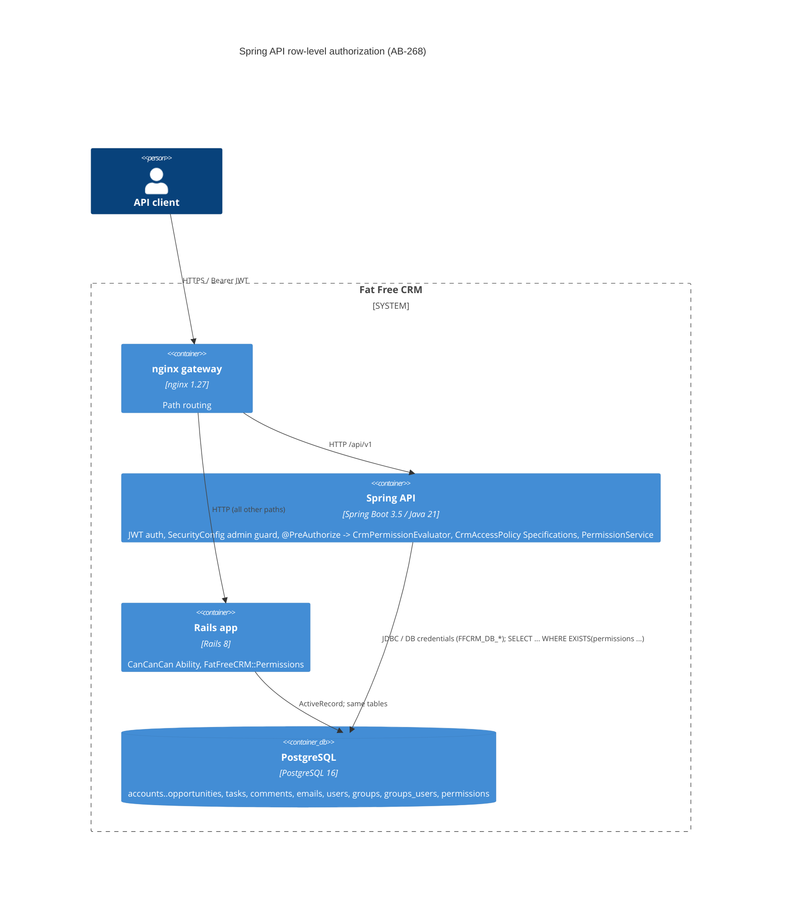

# AB-268. Row-level authorization as JPA Specifications in the Spring API

- **Status:** Proposed
- **Date:** 2026-10-07
- **ARB ticket:** TO BE CREATED
- **Authors:** Devin (AB-268)
- **Owning team:** TBD — owner to confirm before ARB (Fat Free CRM migration team, epic AB-261)
- **Related ADRs:** `0001-spring-boot-api-service-skeleton.md`, `ab-264-jwt-authentication.md`; `docs/migration/target-architecture.md` §2.4/§2.6; Jira AB-261 / AB-268 (AB-269 shares `AccessPolicy`, AB-272 wires `PermissionService`)

## Context

Rails authorizes CRM records with CanCanCan (`app/models/users/ability.rb`). `scope :my` /
`accessible_by` turn the rules into SQL, and `load_and_authorize_resource` checks single records.
Shared access is written through `FatFreeCRM::Permissions` into the `permissions` table. During the
strangler period both Rails and Spring read and write the same rows, so the Spring API must
enforce **exactly** the same visibility. Filtering must happen in SQL, not after loading, so that
pagination totals are correct and nothing leaks. Every `/api/v1` resource ticket after Phase 3
depends on this boundary.

ARB triggers: **T6** (auth boundary change: adds method security, row-level authorization and an
admin-namespace role guard to the Spring API). The detector also flagged T2 for
`lib/fat_free_crm/migration/authz_matrix.rb` and `spring/src/test/resources/authz/authz_fixture.sql`.
That is a false positive: these are test-fixture generators and seed data, with no schema change
and no migration. Not triggered: T1, T3, T4, T5, T7, T8, T9.

## Decision

We will implement authorization in the Spring API as one `AccessPolicy` (`CrmAccessPolicy`) that
returns a JPA Criteria `Specification` per entity type. Permission and group checks use `EXISTS` /
`IN` subqueries, and admin and group state are re-read from the database on each call. The same
Specification backs list queries (composed with search by AB-269) and a Spring Security
`PermissionEvaluator` used by `@PreAuthorize` for single records. `/api/v1/admin/**` requires
`ROLE_ADMIN`. A transactional `PermissionService` writes Shared-access rows with the same semantics
and row shape as Rails. Parity is proven against a matrix generated by real Rails models.

## Alternatives considered

| Alternative | Pros | Cons | Why rejected |
| --- | --- | --- | --- |
| Do nothing (authenticate only) | No work | Every authenticated user sees every record, so private data leaks | Not acceptable for any resource endpoint |
| Post-filter loaded entities in Java | Easy to read | Wrong page totals, loads rows the user may not see, slow on large tables | Ticket requires SQL-side filtering |
| JOIN `permissions`/`groups_users` + `DISTINCT` | One query plan | Fan-out breaks `count`, and `DISTINCT` conflicts with sorting by non-selected columns | `EXISTS` gives the same result without fan-out |
| PostgreSQL row-level security policies | Enforced for every client | Rails connects as the same role and would also be filtered; policies would have to reproduce CanCan in PL/pgSQL; harder to test and roll back | Changes the shared database contract during coexistence |
| Hibernate `@Filter` | Transparent | Must be enabled per session, easy to bypass, does not compose with `Specification` search | Less explicit than a composable Specification |

## Architecture

## Non-functional requirements

| NFR | Target | How met |
| --- | --- | --- |
| Availability SLO | Inherits the Spring API SLO (TBD — owner to confirm before ARB) | No new component; in-process |
| p95 latency | TBD — owner to confirm before ARB | One extra PK lookup for the user per call; `EXISTS` is served by the `index_permissions_on_asset_id_and_asset_type` / `user_id` / `group_id` indexes in the Rails schema |
| RPO / RTO | N/A — no new data store | |
| Peak load | TBD — owner to confirm before ARB | Same query count as Rails `accessible_by` |
| Scaling model | Stateless; scales with the API pods | |
| Data retention | N/A | Reads/writes existing `permissions` rows only |

## Security & compliance

- **Data classification:** CRM business data (contacts, accounts, emails). No new data is stored.
- **Encryption at rest:** Unchanged (existing database).
- **Encryption in transit:** Unchanged (gateway TLS; JDBC per environment).
- **AuthN / AuthZ:** JWT authentication (AB-264) is unchanged. Row-level authorization: default deny
  for unknown types (`IllegalArgumentException`) and unknown users (empty result). The admin flag is
  re-read from `users.admin`, never trusted from the token. 401 unauthenticated, 403 out of scope,
  404 missing (the 403 is the settled, allow-listed delta from Rails' 401).
- **Secrets:** None added.
- **Audit logging:** Not added. Rails does not audit reads either; follow-up for write endpoints in AB-272.
- **Data residency / regions:** Unchanged.
- **Policy sections satisfied:** No infrastructure change, so `policy/approved-infra.yaml` is not
  affected. No new dependencies; Spring Security method security is part of the existing starter.
- **Threats considered:** IDOR on single-record fetch (evaluator); count/pagination leakage
  (SQL-side filter, no fan-out); privilege escalation through stale JWT `admin` claims (DB reload);
  access through destroyed groups (group subquery reads from `groups`); cross-type permission
  confusion (`asset_type` predicate). The existence oracle (403 vs 404) is the same as in Rails.

## Cost

| Item | Assumption | Monthly estimate |
| --- | --- | --- |
| Compute | In-process; no new resources | $0 |
| **Total** | | $0 |

## Operations

- **On-call rotation:** TBD — owner to confirm before ARB.
- **Runbook:** `spring/README.md` § Authorization.
- **Dashboards / alarms:** Existing API 4xx/5xx metrics. A rise in 403s after a resource cutover means a parity regression.
- **Rollback plan:** Route the resource back to Rails at the gateway. No data migration is involved.
- **Migration / cut-over plan:** Each resource ticket uses `accessibleBy` for lists and `hasPermission` for fetches. The contract harness (AB-266) compares Rails and Spring per resource before its route moves.

## Policy exceptions requested

| Rule | Resource | Justification | Compensating control | Expiry |
| --- | --- | --- | --- | --- |
| none | | | | |

## Consequences

- Positive: one source of truth for visibility; list and fetch cannot disagree; correct totals;
  parity with Rails is enforced by CI (`authz-matrix` job plus `AuthorizationMatrixTest`).
- Negative / risks: the rules are duplicated in Ruby and Java until cutover. A change to
  `ability.rb` must regenerate the matrix, and CI fails if it drifts.
- Follow-ups: AB-269 composes search with `accessibleBy`; AB-272 exposes `PermissionService`;
  contract-harness fetch cases once AB-266 lands on the epic branch.

## Open questions

- Ownership, SLO and latency targets (TBD above).
- Whether the post-cutover API should return 404 instead of 403 for out-of-scope records, to hide
  existence (Rails leaks it today).
