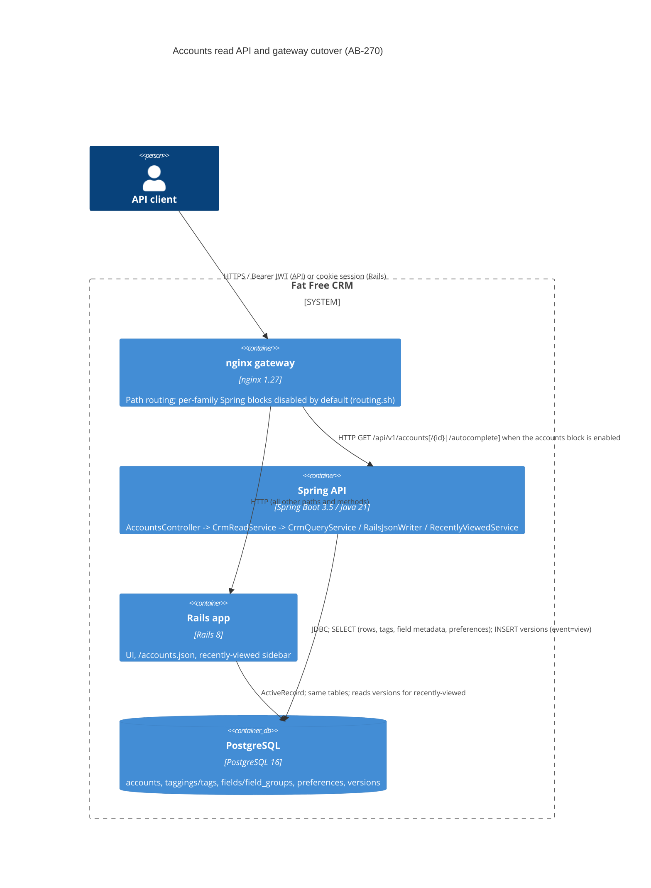

# AB-270. Rails-compatible read API foundation and Accounts read cutover path

- **Status:** Proposed
- **Date:** 2026-10-07
- **ARB ticket:** TO BE CREATED
- **Authors:** Devin (AB-270 phase A)
- **Owning team:** TBD — owner to confirm before ARB (Fat Free CRM migration team, epic AB-261)
- **Related ADRs:** `0001-spring-boot-api-service-skeleton.md`, `ab-264-jwt-authentication.md`, `ab-268-authorization-specifications.md`; `docs/migration/target-architecture.md` §2.5/§2.6 and "AJAX→JSON mappings"; Jira AB-261 / AB-270

## Context

AB-270 starts traffic shifting in the strangler migration. Every CRM family needs Spring
`index` / `show` / `autocomplete` reads that return the same rows and values as Rails
`respond_with(...).to_json`, against the shared PostgreSQL database, before the gateway can route
the family's GETs to Spring. Phase A builds the shared foundation and the Accounts family; phase B
families (campaigns, contacts+leads, opportunities, tasks/comments/emails/lists,
users/me+home+admin+metadata) reuse it.

Constraints: the Rails schema is shared and frozen (Flyway V1, `ddl-auto: validate`); runtime
`cf_*` custom-field columns exist outside the JPA mapping until AB-271; Rails reads have a write
side effect (a PaperTrail `view` row that the Rails UI's recently-viewed sidebar reads); Rails list
state (category filter, sort/per-page preferences, page/query) lives in the cookie session.

ARB triggers (manual review of the diff): **T4** (new sync API contract: `/api/v1/accounts` list
envelope, show and autocomplete become the supported read contract for API clients) and **T6**
(network boundary: new named gateway routing blocks that move Accounts GETs from Rails to Spring when
enabled; they ship disabled). The heuristic detector reported only T7 on
`cases/ab-270-accounts-read.yml` (`rails: {path: /accounts/auto_complete.json}`); that is a false
positive — a contract-test case naming the existing Rails endpoint, no framework introduced.
Not triggered: T1, T2, T3, T5, T7, T8, T9.

## Decision

We will serialize Spring read responses from the database row rather than from hand-written DTOs:
`RailsRowRepository` reads `SELECT *` by id for a descriptor-whitelisted table and `RailsJsonWriter`
maps each column by its PostgreSQL type to the Rails `as_json` form (numeric → string, timestamps →
UTC ISO-8601 milliseconds, YAML arrays → JSON arrays, `tag_list` appended, password/token/salt
columns never emitted). Lists keep going through `CrmQueryService` (AB-268 `accessibleBy` + AB-269
search); `CrmReadService` adds show (authorized by `CrmPermissionEvaluator`) with the Rails `view`
version written in its own `REQUIRES_NEW` transaction whose failure never fails the read, and
autocomplete. Rails session state becomes explicit, stateless query parameters (`category`,
`page`, `query`, `sort_by`, `per_page`) with the Rails user preferences as defaults. Each family gets
a disabled-by-default nginx routing block toggled by `spring/gateway/routing.sh`; a block is enabled
only after its enforced contract cases are diff-clean.

## Alternatives considered

| Alternative | Pros | Cons | Why rejected |
| --- | --- | --- | --- |
| Do nothing (keep AB-269's throwaway list endpoint) | No work | No show/autocomplete; no cutover path | Ticket scope |
| Hand-written DTO per entity (AB-269 `AccountResponse` style) | Compile-time types | Field lists drift from the schema; misses runtime `cf_*` columns; repeated for ~10 entities | Ticket asks for metadata-driven serialization |
| Serialize JPA entities via Hibernate metamodel | Single read path | `cf_*` columns are not mapped; association/FK and YAML handling still need per-type rules | Same completeness gap as DTOs |
| Skip the `view` version write in Spring | Pure reads | Rails recently-viewed sidebar silently stops updating after cutover | Settled decision 4 requires parity |
| Route Rails `/accounts.json` itself to Spring | Clients unchanged | Spring envelope/error contract differs from Rails' bare arrays and text errors | Gateway routes only `/api/v1/*` paths |

## Architecture

## Non-functional requirements

| NFR | Target | How met |
| --- | --- | --- |
| Availability SLO | Inherits the Spring API SLO (TBD — owner to confirm before ARB) | No new component |
| p95 latency | TBD — owner to confirm before ARB | Per list page: the AB-269 page + count queries, one `SELECT * ... WHERE id IN (...)`, one batched taggings query, facet counts; show adds one INSERT |
| RPO / RTO | N/A — no new data store | `versions` rows are the same rows Rails writes |
| Peak load | TBD — owner to confirm before ARB | Same order of queries as the Rails controller |
| Scaling model | Stateless; scales with the API pods | Session state replaced by query parameters |
| Data retention | Unchanged | `versions` growth from views equals Rails today |

## Security & compliance

- **Data classification:** CRM business data (accounts). No new data is stored; the `view` version
  row is the one Rails already writes.
- **Encryption at rest / in transit:** Unchanged.
- **AuthN / AuthZ:** JWT (AB-264). Lists filtered SQL-side by `accessibleBy` (AB-268); show via
  `hasPermission(#id, 'Account', 'read')` (401/404/403); autocomplete filtered by `accessibleBy`.
  The 401→403 delta for out-of-scope records is the existing allow-listed difference.
- **Injection:** the serializer's table name comes only from a code descriptor validated against
  `[a-z][a-z0-9_]*`; ids are bound parameters.
- **Sensitive columns:** a global name filter drops any `*password*`, `*token*`, `*salt*` column in
  addition to per-resource exclusions (prepares the User family).
- **Secrets:** None added.
- **Audit logging:** `view` events are recorded exactly as in Rails (`whodunnit` = user id).
- **Policy sections satisfied:** No infrastructure resources; `policy/approved-infra.yaml` not affected. No new dependencies.

## Cost

| Item | Assumption | Monthly estimate |
| --- | --- | --- |
| Compute / storage | In-process; no new resources | $0 |
| **Total** | | $0 |

## Operations

- **On-call rotation:** TBD — owner to confirm before ARB.
- **Runbook:** `spring/README.md` § Accounts read API and § Adding a read family; `spring/contract-diff.md`.
- **Cutover:** `spring/gateway/routing.sh enable upstream accounts` then `nginx -t && nginx -s reload`, only after the Accounts enforced contract cases are clean.
- **Rollback plan:** `routing.sh disable accounts` (re-comments the block) and reload nginx. No data migration.
- **Dashboards / alarms:** Existing API 4xx/5xx metrics; WARN log `Unable to record recently viewed` signals view-recording failures.

## Policy exceptions requested

| Rule | Resource | Justification | Compensating control | Expiry |
| --- | --- | --- | --- | --- |
| none | | | | |

## Consequences

- Positive: one serializer and read service for every family; new columns (including `cf_*`) appear
  automatically; per-family cutover and rollback are a config toggle.
- Negative / risks: list reads load each page twice (JPA ids, then JDBC rows); the JSON shape follows
  the schema, so a schema change is an API change (same as Rails today).
- Follow-ups: phase B families; AB-271 replaces physical `cf_*` columns with JSONB (the writer's
  `json/jsonb` mapping and check-box metadata lookup are the seams); User `to_json` override in the
  users family.

## Open questions

- Ownership, SLO and latency targets (TBD above).
- Whether API clients need persisted list preferences writes (Rails `redraw` writes them; Spring only reads them).

## Family: campaigns

- **Routed surface:** `GET /api/v1/campaigns` (list + `status` facet envelope),
  `GET /api/v1/campaigns/{id}` (show + `view` version row), and
  `GET /api/v1/campaigns/autocomplete` (`related` supports bare ids and `users/<id>`).
- **Gateway block:** `Spring routing: campaigns` markers in `spring/gateway/nginx.conf`;
  `routing.sh enable upstream campaigns` activates it independently of accounts.
- **Parity evidence:** `spring/src/test/resources/search/campaigns_search_matrix.json`
  (45 recorded cases replayed by `RailsCampaignSearchParityTest`),
  `CampaignsControllerIntegrationTest`, and `ab-270-campaigns-read.yml` (21 enforced
  contract cases, no allow-list entries).
- **Deviations:** none vs the Accounts foundation. Recorded Rails quirk documented in the
  matrix: `POST /campaigns/filter` returns 500 when the filtered result contains a
  NULL-status campaign (`campaigns/_status.html.haml` calls `status.to_sym`), so the
  `other` session filter never persists in real Rails; those cases carry `post_status`
  and are replayed unfiltered. Facet key order is `all, other, <statuses>` (sidebar
  build order), unlike accounts' `<categories>, all, other`.
