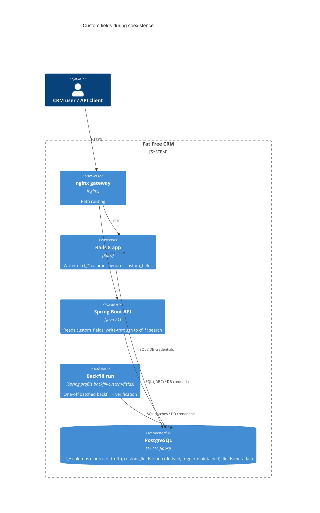

# AB-271. Custom fields: `custom_fields jsonb` column, sync trigger and dual-read shim

- **Status:** Proposed
- **Date:** 2026-10-07
- **ARB ticket:** TO BE CREATED
- **Authors:** Devin (AB-271)
- **Owning team:** TBD — owner to confirm before ARB (Fat Free CRM migration team, epic AB-261)
- **Related ADRs:** `0001-spring-boot-api-service-skeleton.md`; spike AB-267
  (`docs/migration/spikes/custom-fields-dual-read-design.md`,
  `docs/migration/spikes/custom-fields-jsonb-benchmark.md`); `docs/migration/custom-fields-migration.md`

## Context

Fat Free CRM stores custom fields as dynamic `cf_*` columns that Rails adds at runtime
(`CustomField#add_column`) on accounts, campaigns, contacts, leads, opportunities and tasks. The
set of columns differs per deployment, so the Spring Boot service (Hibernate `ddl-auto: validate`)
cannot map them statically. The epic decided to move custom fields into one `custom_fields jsonb`
column per table; the AB-267 spike chose the design and indexes. During the strangler coexistence
Rails stays the writer of `cf_*` columns and must keep working unchanged against the shared
PostgreSQL schema, and its JSON output (frozen OpenAPI contract) must not change.

ARB triggers: **T2** (changed data store — new column, PL/pgSQL trigger function and GIN indexes
on six shared business tables), **T4** (shared-schema contract between Rails and Spring: the
trigger is the synchronous sync mechanism between the two applications' representations).
Not triggered: T1 (the backfill is a profile of the existing Spring artifact run once by an
operator, not a new deployable or scheduled job), T3 (the only new dependency is the compile-only
`spotbugs-annotations`; no vendor/network), T5 (no infrastructure), T6 (no new endpoint or auth
change; `SecurityConfig` is only excluded under the non-web backfill profile), T7, T8, T9.

## Decision

We will add a nullable `custom_fields jsonb` column (Flyway V2) to the six tables, kept in sync
from the authoritative `cf_*` columns by a `BEFORE INSERT OR UPDATE` row trigger
`ffcrm_sync_custom_fields(klass)` that discovers `cf_*` columns dynamically via `to_jsonb(NEW)`,
plus `GIN (custom_fields jsonb_path_ops)` indexes created `CONCURRENTLY` (V3, non-transactional,
Flyway transactional lock disabled). Existing rows are populated by an explicit, batched,
idempotent `CustomFieldsBackfillJob` (profile `backfill-custom-fields`) that ends with a
verification report and a non-zero exit on any drift. Rails ignores the column
(`ignored_columns` in `has_fields`). Java reads JSONB only (metadata-driven by the `fields` table
via `CustomFieldRegistry`), writes through to `cf_*` columns in Rails representation
(`CustomFieldWriteService`), searches through `CustomFieldPredicates` on the GIN-indexed column,
and can audit parity with `CustomFieldConsistencyCheck`.

## Alternatives considered

| Alternative | Pros | Cons | Why rejected |
| --- | --- | --- | --- |
| Do nothing (Spring reads `cf_*` via dynamic JDBC) | No schema change | No static mapping, per-deployment SQL, no index strategy, cutover still needs the move | Leaves the epic decision unimplemented |
| Application-level dual write (Rails writes JSONB too) | No trigger | Requires Rails code changes on every write path, misses raw SQL/console writes | Higher risk to Rails; trigger covers every writer |
| Async sync (CDC / job) | No write-path cost | Stale reads, extra infrastructure (T1/T5) | Spike measured trigger cost as acceptable; consistency needed for read parity |
| Backfill as a Flyway migration | Automatic | One long transaction on large tables, blocks deploys, not restartable | Settled design: explicit batched job |

## Architecture

## Non-functional requirements

| NFR | Target | How met |
| --- | --- | --- |
| Availability SLO | No downtime for the migration | V2 is catalog-only (nullable, no default); V3 uses `CREATE INDEX CONCURRENTLY` |
| p95 latency | Write overhead within spike measurements | Trigger skips `fields` lookup unless a value looks like YAML; `IS DISTINCT FROM` no-op skip |
| RPO / RTO | Unchanged (no new store) | `cf_*` stays authoritative; JSONB is rebuildable by re-running the backfill |
| Peak load | TBD — owner to confirm before ARB | Backfill batch size `ffcrm.custom-fields.backfill.batch-size` (default 10000), one transaction per batch |
| Scaling model | Unchanged | Same database |
| Data retention | Unchanged | Derived copy of existing data |

## Security & compliance

- **Data classification:** unchanged — duplicates existing custom-field business data in the same table.
- **Encryption at rest:** unchanged (same database).
- **Encryption in transit:** unchanged.
- **AuthN / AuthZ:** no new endpoints; search composes with AB-268 `accessibleBy` as before.
- **Secrets:** none added; backfill uses the existing `FFCRM_DB_*` variables.
- **Audit logging:** backfill prints its verification report (stdout/log) and exits non-zero on drift.
- **Data residency / regions:** unchanged.
- **Policy sections satisfied:** additive-only Flyway migrations; V1 untouched; `ddl-auto: validate`.
- **Threats considered:** dynamic SQL in write/backfill paths — column names are validated against
  `^cf_[a-z0-9_]+$` and the live `information_schema` set; values are bound parameters.

## Cost

| Item | Assumption | Monthly estimate |
| --- | --- | --- |
| Extra storage | JSONB copy + GIN index per table, roughly proportional to custom-field data volume | TBD — owner to confirm before ARB |
| **Total** | No new infrastructure | TBD (expected negligible) |

## Operations

- **On-call rotation:** TBD — migration team.
- **Runbook:** `spring/README.md` → custom-fields backfill section.
- **Dashboards / alarms:** none new; backfill exit code and report; `CustomFieldConsistencyCheck` for drift audits.
- **Rollback plan:** drop the six triggers and the column/indexes in a new additive-reversal migration;
  Rails is unaffected because it ignores the column and `cf_*` remains authoritative.
- **Migration / cut-over plan:** deploy V2/V3 → run backfill profile → verify zero drift → later
  cutover per design doc §7 (Spring becomes writer; `cf_*` columns retired in a later phase).

## Policy exceptions requested

| Rule | Resource | Justification | Compensating control | Expiry |
| --- | --- | --- | --- | --- |
| none | | | | |

## Consequences

- Positive: Spring can map, read, write and index custom fields without per-deployment schema
  knowledge; Rails behaviour and JSON output unchanged.
- Negative / risks: every write to the six tables pays a trigger cost; two representations
  co-exist until cutover; rows with YAML the SQL decoder cannot parse carry `$yaml` markers until
  the backfill resolves them in Java.
- Follow-ups: AB-270 exposes definitions (`CustomFieldDefinitionDto`) and values; AB-272 wires
  `CustomFieldWriteService` into write endpoints; cutover ticket drops the trigger.

## Open questions

- Peak write rate and table sizes per deployment (to size backfill batches and confirm trigger overhead).
- Owning team / on-call for the backfill run.
