# Fat Free CRM — Data Model Reference

Source: `db/schema.rb`, schema version `2026_04_13_041448` (ActiveRecord 8.0).

> **Important caveat**: `db/schema.rb` is NOT the complete live schema. The custom-field
> framework (`app/models/fields/custom_field.rb`) adds real `cf_*` columns to entity tables
> at runtime via `ALTER TABLE`, so any production database will typically have more columns
> than this file shows. See [custom-fields-migration.md](custom-fields-migration.md).

## Contents

1. [ERD](#erd)
2. [Data dictionary](#data-dictionary)
3. [Polymorphic associations](#polymorphic-associations)
4. [Join tables](#join-tables)
5. [Serialized columns](#serialized-columns)
6. [PaperTrail `versions` table](#papertrail-versions-table)

---

## ERD

Framework infrastructure tables (`solid_queue_*`, `active_storage_*`, `action_text_rich_texts`,
`sessions`) are listed in the data dictionary but omitted from the diagram for readability.
Dashed-style relationships below are polymorphic (no FK constraint in the DB; the "one" side is
identified by a `*_type` + `*_id` column pair).

```mermaid
erDiagram
    USERS ||--o{ ACCOUNTS : "user_id (owner)"
    USERS ||--o{ ACCOUNTS : "assigned_to"
    USERS ||--o{ CAMPAIGNS : "user_id / assigned_to"
    USERS ||--o{ CONTACTS : "user_id / assigned_to"
    USERS ||--o{ LEADS : "user_id / assigned_to"
    USERS ||--o{ OPPORTUNITIES : "user_id / assigned_to"
    USERS ||--o{ TASKS : "user_id / assigned_to / completed_by"
    USERS ||--o{ COMMENTS : "user_id"
    USERS ||--o{ EMAILS : "user_id"
    USERS ||--o{ ACTIVITIES : "user_id"
    USERS ||--o{ PREFERENCES : "user_id"
    USERS ||--o{ LISTS : "user_id"
    USERS ||--o{ AVATARS : "user_id"
    USERS ||--o{ PERMISSIONS : "user_id"
    GROUPS ||--o{ GROUPS_USERS : "group_id"
    USERS ||--o{ GROUPS_USERS : "user_id"
    GROUPS ||--o{ PERMISSIONS : "group_id"

    CAMPAIGNS ||--o{ LEADS : "campaign_id"
    CAMPAIGNS ||--o{ OPPORTUNITIES : "campaign_id"
    LEADS ||--o{ CONTACTS : "lead_id (converted from)"
    CONTACTS ||--o{ CONTACTS : "reports_to"

    ACCOUNTS ||--o{ ACCOUNT_CONTACTS : "account_id"
    CONTACTS ||--o{ ACCOUNT_CONTACTS : "contact_id"
    ACCOUNTS ||--o{ ACCOUNT_OPPORTUNITIES : "account_id"
    OPPORTUNITIES ||--o{ ACCOUNT_OPPORTUNITIES : "opportunity_id"
    CONTACTS ||--o{ CONTACT_OPPORTUNITIES : "contact_id"
    OPPORTUNITIES ||--o{ CONTACT_OPPORTUNITIES : "opportunity_id"

    TASKS }o..|| ACCOUNTS : "asset (polymorphic)"
    TASKS }o..|| CONTACTS : "asset (polymorphic)"
    TASKS }o..|| LEADS : "asset (polymorphic)"
    TASKS }o..|| OPPORTUNITIES : "asset (polymorphic)"
    TASKS }o..|| CAMPAIGNS : "asset (polymorphic)"

    COMMENTS }o..|| ACCOUNTS : "commentable (polymorphic)"
    COMMENTS }o..|| CONTACTS : "commentable (polymorphic)"
    COMMENTS }o..|| LEADS : "commentable (polymorphic)"
    COMMENTS }o..|| OPPORTUNITIES : "commentable (polymorphic)"
    COMMENTS }o..|| CAMPAIGNS : "commentable (polymorphic)"
    COMMENTS }o..|| TASKS : "commentable (polymorphic)"

    EMAILS }o..|| ACCOUNTS : "mediator (polymorphic)"
    EMAILS }o..|| CONTACTS : "mediator (polymorphic)"
    EMAILS }o..|| LEADS : "mediator (polymorphic)"
    EMAILS }o..|| OPPORTUNITIES : "mediator (polymorphic)"
    EMAILS }o..|| CAMPAIGNS : "mediator (polymorphic)"
    EMAILS }o..|| TASKS : "mediator (polymorphic)"

    ADDRESSES }o..|| ACCOUNTS : "addressable (polymorphic)"
    ADDRESSES }o..|| CONTACTS : "addressable (polymorphic)"
    ADDRESSES }o..|| LEADS : "addressable (polymorphic)"

    AVATARS }o..|| USERS : "entity (polymorphic)"
    PERMISSIONS }o..|| ACCOUNTS : "asset (polymorphic)"
    ACTIVITIES }o..|| ACCOUNTS : "subject (polymorphic)"
    VERSIONS }o..|| ACCOUNTS : "item + related (polymorphic)"

    FIELD_GROUPS ||--o{ FIELDS : "field_group_id"
    TAGS ||--o{ TAGGINGS : "tag_id"
    TAGS ||--o{ FIELD_GROUPS : "tag_id"
    TAGGINGS }o..|| ACCOUNTS : "taggable (polymorphic)"
    USERS ||--o{ LEADS : "..."

    ACCOUNTS {
        integer id PK
        integer user_id FK
        integer assigned_to FK
        string name "limit 64, NOT NULL, default ''"
        string access "limit 8, default 'Public'"
        string email
        integer rating "default 0"
        string category
        text subscribed_users "serialized Array"
        integer contacts_count "counter cache"
        integer opportunities_count "counter cache"
        decimal latitude
        decimal longitude
        datetime deleted_at "soft delete"
    }
    CONTACTS {
        integer id PK
        integer user_id FK
        integer lead_id FK
        integer assigned_to FK
        integer reports_to FK
        string first_name "NOT NULL"
        string last_name "NOT NULL"
        string access
        string email
        date born_on
        boolean do_not_call "NOT NULL default false"
        text subscribed_users "serialized Array"
        datetime deleted_at
    }
    LEADS {
        integer id PK
        integer user_id FK
        integer campaign_id FK
        integer assigned_to FK
        string first_name "NOT NULL"
        string last_name "NOT NULL"
        string company
        string source
        string status
        integer rating "NOT NULL default 0"
        text subscribed_users "serialized Array"
        datetime deleted_at
    }
    OPPORTUNITIES {
        integer id PK
        integer user_id FK
        integer campaign_id FK
        integer assigned_to FK
        string name "NOT NULL"
        string stage
        integer probability
        decimal amount "12,2"
        decimal discount "12,2"
        date closes_on
        text subscribed_users "serialized Array"
        datetime deleted_at
    }
    CAMPAIGNS {
        integer id PK
        integer user_id FK
        integer assigned_to FK
        string name "NOT NULL"
        string status
        decimal budget "12,2"
        integer target_leads
        float target_conversion
        decimal target_revenue "12,2"
        date starts_on
        date ends_on
        text subscribed_users "serialized Array"
        datetime deleted_at
    }
    TASKS {
        integer id PK
        integer user_id FK
        integer assigned_to FK
        integer completed_by FK
        string name "NOT NULL"
        string asset_type "polymorphic"
        integer asset_id "polymorphic"
        string priority
        string category
        string bucket
        datetime due_at
        datetime completed_at
        text subscribed_users "serialized Array"
        datetime deleted_at
    }
    COMMENTS {
        integer id PK
        integer user_id FK
        string commentable_type "polymorphic"
        integer commentable_id "polymorphic"
        boolean private
        text comment
        string state "default 'Expanded'"
    }
    EMAILS {
        integer id PK
        string imap_message_id "NOT NULL"
        integer user_id FK
        string mediator_type "polymorphic"
        integer mediator_id "polymorphic"
        string sent_from "NOT NULL"
        string sent_to "NOT NULL"
        text body
        datetime sent_at
        datetime deleted_at
    }
    ADDRESSES {
        integer id PK
        string street1
        string city
        string state
        string zipcode
        string country
        string address_type "'Business'/'Billing'/'Shipping'"
        string addressable_type "polymorphic"
        integer addressable_id "polymorphic"
        datetime deleted_at
    }
    USERS {
        integer id PK
        string username "NOT NULL, unique w/ deleted_at"
        string email
        string encrypted_password "Devise"
        boolean admin "NOT NULL default false"
        datetime suspended_at
        datetime deleted_at
    }
    ACCOUNT_CONTACTS {
        integer id PK
        integer account_id FK
        integer contact_id FK
        datetime deleted_at
    }
    ACCOUNT_OPPORTUNITIES {
        integer id PK
        integer account_id FK
        integer opportunity_id FK
        datetime deleted_at
    }
    CONTACT_OPPORTUNITIES {
        integer id PK
        integer contact_id FK
        integer opportunity_id FK
        string role
        datetime deleted_at
    }
    GROUPS {
        integer id PK
        string name
    }
    GROUPS_USERS {
        integer group_id FK
        integer user_id FK
    }
    PERMISSIONS {
        integer id PK
        integer user_id FK
        integer group_id FK
        string asset_type "polymorphic"
        integer asset_id "polymorphic"
    }
    PREFERENCES {
        integer id PK
        integer user_id FK
        string name "NOT NULL"
        text value "serialized (Base64+Marshal)"
    }
    ACTIVITIES {
        integer id PK
        integer user_id FK
        string subject_type "polymorphic"
        integer subject_id "polymorphic"
        string action "default 'created'"
    }
    AVATARS {
        integer id PK
        integer user_id FK
        string entity_type "polymorphic"
        integer entity_id "polymorphic"
    }
    FIELD_GROUPS {
        integer id PK
        string name
        string label
        integer position
        integer tag_id FK
        string klass_name "target entity class"
    }
    FIELDS {
        integer id PK
        string type "STI: CoreField/CustomField/..."
        integer field_group_id FK
        string name "cf_* column name"
        string label
        string as "field type key"
        text collection "serialized Array"
        text settings "serialized Hash"
        boolean required
        integer pair_id FK
    }
    TAGS {
        integer id PK
        string name "unique"
        integer taggings_count
    }
    TAGGINGS {
        integer id PK
        integer tag_id FK
        integer taggable_id "polymorphic"
        string taggable_type "polymorphic"
        integer tagger_id "polymorphic"
        string tagger_type "polymorphic"
        string context
    }
    VERSIONS {
        integer id PK
        string item_type "polymorphic, NOT NULL"
        integer item_id "NOT NULL"
        string event
        string whodunnit "user id as string"
        text object "YAML snapshot"
        text object_changes "YAML diff"
        integer related_id "polymorphic"
        string related_type "polymorphic"
        integer transaction_id
    }
    LISTS {
        integer id PK
        string name
        text url
        integer user_id FK
    }
    SETTINGS {
        integer id PK
        string name "NOT NULL"
        text value "serialized"
    }
    RESEARCH_TOOLS {
        integer id PK
        string name
        string url_template
        boolean enabled "NOT NULL default false"
    }
```



---

## Data dictionary

Conventions common to most application tables:

- Integer surrogate PK `id` (implicit in `create_table`).
- **No database-level foreign key constraints** on application tables (only Active Storage
  and Solid Queue have real FKs). All `*_id` columns are plain integers; referential
  integrity is enforced by the Rails layer only. A JPA target should add real FKs.
- **Soft delete**: `deleted_at datetime` (paranoia-style). Rows with non-NULL `deleted_at`
  are "deleted" and participate in unique indexes (e.g. `[user_id, name, deleted_at]`).
- **Ownership/permissions trio** on entities: `user_id` (creator/owner), `assigned_to`
  (assignee, both reference `users.id`), and `access` (`'Public' | 'Private' | 'Shared'`;
  `Shared` uses the `permissions` table).
- Timestamps `created_at` / `updated_at` (`precision: nil` on legacy tables).

### accounts

| Column | Type | Null | Default | Notes |
|---|---|---|---|---|
| id | integer | no | | PK |
| user_id | integer | yes | | owner → users.id |
| assigned_to | integer | yes | | assignee → users.id |
| name | string(64) | no | `""` | |
| access | string(8) | yes | `Public` | Public/Private/Shared |
| website | string(64) | yes | | |
| toll_free_phone | string(32) | yes | | |
| phone | string(32) | yes | | |
| fax | string(32) | yes | | |
| deleted_at | datetime | yes | | soft delete |
| created_at / updated_at | datetime | yes | | |
| email | string(254) | yes | | |
| background_info | string | yes | | |
| rating | integer | no | 0 | |
| category | string(32) | yes | | |
| subscribed_users | text | yes | | serialized Array of user ids |
| contacts_count | integer | yes | 0 | counter cache |
| opportunities_count | integer | yes | 0 | counter cache |
| wikidata_id | string | yes | | |
| latitude | decimal(10,6) | yes | | |
| longitude | decimal(10,6) | yes | | |
| blog, linkedin, facebook, twitter, bluesky, instagram, mastodon | string | yes | | web presence |

Indexes: `[assigned_to]`; unique `[user_id, name, deleted_at]`.

### contacts

| Column | Type | Null | Default | Notes |
|---|---|---|---|---|
| id | integer | no | | PK |
| user_id | integer | yes | | owner |
| lead_id | integer | yes | | lead it was promoted from |
| assigned_to | integer | yes | | |
| reports_to | integer | yes | | self-reference → contacts.id |
| first_name | string(64) | no | `""` | |
| last_name | string(64) | no | `""` | |
| access | string(8) | yes | `Public` | |
| title | string(64) | yes | | |
| department | string(64) | yes | | |
| source | string(32) | yes | | |
| email / alt_email | string(254) | yes | | |
| phone / mobile / fax | string(32) | yes | | |
| blog, linkedin, facebook, twitter | string(128) | yes | | |
| born_on | date | yes | | |
| do_not_call | boolean | no | false | |
| deleted_at | datetime | yes | | |
| created_at / updated_at | datetime | yes | | |
| background_info | string | yes | | |
| subscribed_users | text | yes | | serialized Array |
| zoom, teams, signal, instagram, mastodon, bluesky | string(128) | yes | | |

Indexes: `[assigned_to]`; unique `[user_id, last_name, deleted_at]` (`id_last_name_deleted`).

### leads

| Column | Type | Null | Default | Notes |
|---|---|---|---|---|
| id | integer | no | | PK |
| user_id | integer | yes | | |
| campaign_id | integer | yes | | → campaigns.id |
| assigned_to | integer | yes | | |
| first_name | string(64) | no | `""` | |
| last_name | string(64) | no | `""` | |
| access | string(8) | yes | `Public` | |
| title | string(64) | yes | | |
| company | string(64) | yes | | |
| source | string(32) | yes | | |
| status | string(32) | yes | | e.g. new/contacted/converted |
| referred_by | string(64) | yes | | |
| email / alt_email | string(254) | yes | | |
| phone / mobile | string(32) | yes | | |
| blog, linkedin, facebook, twitter | string(128) | yes | | |
| rating | integer | no | 0 | |
| do_not_call | boolean | no | false | |
| deleted_at | datetime | yes | | |
| created_at / updated_at | datetime | yes | | |
| background_info | string | yes | | |
| subscribed_users | text | yes | | serialized Array |
| zoom, teams, signal, instagram, mastodon, bluesky | string(128) | yes | | |

Indexes: `[assigned_to]`; unique `[user_id, last_name, deleted_at]`.

### opportunities

| Column | Type | Null | Default | Notes |
|---|---|---|---|---|
| id | integer | no | | PK |
| user_id | integer | yes | | |
| campaign_id | integer | yes | | |
| assigned_to | integer | yes | | |
| name | string(64) | no | `""` | |
| access | string(8) | yes | `Public` | |
| source | string(32) | yes | | |
| stage | string(32) | yes | | pipeline stage |
| probability | integer | yes | | percent |
| amount | decimal(12,2) | yes | | |
| discount | decimal(12,2) | yes | | |
| closes_on | date | yes | | |
| deleted_at | datetime | yes | | |
| created_at / updated_at | datetime | yes | | |
| background_info | string | yes | | |
| subscribed_users | text | yes | | serialized Array |

Indexes: `[assigned_to]`; unique `[user_id, name, deleted_at]` (`id_name_deleted`).

### campaigns

| Column | Type | Null | Default | Notes |
|---|---|---|---|---|
| id | integer | no | | PK |
| user_id / assigned_to | integer | yes | | |
| name | string(64) | no | `""` | |
| access | string(8) | yes | `Public` | |
| status | string(64) | yes | | |
| budget | decimal(12,2) | yes | | |
| target_leads | integer | yes | | |
| target_conversion | float | yes | | |
| target_revenue | decimal(12,2) | yes | | |
| leads_count / opportunities_count | integer | yes | | counter caches |
| revenue | decimal(12,2) | yes | | |
| starts_on / ends_on | date | yes | | |
| objectives | text | yes | | |
| deleted_at | datetime | yes | | |
| created_at / updated_at | datetime | yes | | |
| background_info | string | yes | | |
| subscribed_users | text | yes | | serialized Array |

Indexes: `[assigned_to]`; unique `[user_id, name, deleted_at]`.

### tasks

| Column | Type | Null | Default | Notes |
|---|---|---|---|---|
| id | integer | no | | PK |
| user_id / assigned_to / completed_by | integer | yes | | → users.id |
| name | string | no | `""` | |
| asset_type / asset_id | string / integer | yes | | polymorphic → any entity |
| priority | string(32) | yes | | |
| category | string(32) | yes | | |
| bucket | string(32) | yes | | temporal bucket (due_today, overdue, ...) |
| due_at / completed_at | datetime | yes | | |
| deleted_at | datetime | yes | | |
| created_at / updated_at | datetime | yes | | |
| background_info | string | yes | | |
| subscribed_users | text | yes | | serialized Array |

Indexes: `[assigned_to]`; unique `[user_id, name, deleted_at]`.

### comments

| Column | Type | Null | Default | Notes |
|---|---|---|---|---|
| id | integer | no | | PK |
| user_id | integer | yes | | author |
| commentable_type / commentable_id | string / integer | yes | | polymorphic |
| private | boolean | yes | | |
| title | string | yes | `""` | |
| comment | text | yes | | |
| created_at / updated_at | datetime | yes | | |
| state | string(16) | no | `Expanded` | UI state (Expanded/Collapsed) |

No indexes (a JPA target should index `[commentable_type, commentable_id]`).

### emails

| Column | Type | Null | Default | Notes |
|---|---|---|---|---|
| id | integer | no | | PK |
| imap_message_id | string | no | | IMAP Message-ID |
| user_id | integer | yes | | |
| mediator_type / mediator_id | string / integer | yes | | polymorphic link to entity |
| sent_from / sent_to | string | no | | |
| cc / bcc | string | yes | | |
| subject | string | yes | | |
| body / header | text | yes | | |
| sent_at / received_at | datetime | yes | | |
| deleted_at | datetime | yes | | |
| created_at / updated_at | datetime | yes | | |
| state | string(16) | no | `Expanded` | |

Indexes: `[mediator_id, mediator_type]`.

### addresses

| Column | Type | Null | Default | Notes |
|---|---|---|---|---|
| id | integer | no | | PK |
| street1 / street2 | string | yes | | |
| city / state / country | string(64) | yes | | |
| zipcode | string(16) | yes | | |
| full_address | string | yes | | denormalized |
| address_type | string(16) | yes | | Business / Billing / Shipping |
| addressable_type / addressable_id | string / integer | yes | | polymorphic |
| created_at / updated_at / deleted_at | datetime | yes | | |

Indexes: `[addressable_id, addressable_type]`.

### users

| Column | Type | Null | Default | Notes |
|---|---|---|---|---|
| id | integer | no | | PK |
| username | string(32) | no | `""` | |
| email / alt_email / unconfirmed_email | string(254) | yes | | |
| first_name / last_name | string(32) | yes | | |
| title / company | string(64) | yes | | |
| phone / mobile / google | string(32) | yes | | |
| encrypted_password | string | no | `""` | Devise (bcrypt) |
| password_salt | string | no | `""` | legacy |
| last_sign_in_at / current_sign_in_at | datetime | yes | | Devise trackable |
| last_sign_in_ip / current_sign_in_ip | string | yes | | |
| sign_in_count | integer | no | 0 | |
| deleted_at / suspended_at | datetime | yes | | |
| created_at / updated_at | datetime | yes | | |
| admin | boolean | no | false | |
| reset_password_token / reset_password_sent_at | string / datetime | yes | | Devise recoverable |
| remember_token / remember_created_at | string / datetime | yes | | Devise rememberable |
| authentication_token | string | yes | | API token |
| confirmation_token / confirmed_at / confirmation_sent_at | string(255) / datetime | yes | | Devise confirmable |
| subscribe_to_comment_replies | boolean | no | true | |
| receive_assigned_notifications | boolean | no | true | |
| zoom, teams, signal, instagram, facebook, mastodon, bluesky, twitter, linkedin, blog | string(128) | yes | | web presence |

Indexes: unique `[authentication_token]`, `[confirmation_token]`, `[remember_token]`,
`[reset_password_token]`, `[username, deleted_at]`; non-unique `[email]`.

### account_contacts / account_opportunities / contact_opportunities

See [Join tables](#join-tables).

### groups / groups_users / permissions

| Table | Columns | Notes |
|---|---|---|
| groups | id, name, timestamps | user groups for shared access |
| groups_users | group_id, contact_id — actually `group_id`, `user_id` (no PK, `id: false`) | pure join table; indexes on `[group_id, user_id]`, `[group_id]`, `[user_id]` |
| permissions | id, user_id, asset_type, asset_id (polymorphic), group_id, timestamps | grants Shared access on an asset to a user or group; indexes `[asset_id, asset_type]`, `[group_id]`, `[user_id]` |

### preferences

| Column | Type | Null | Default | Notes |
|---|---|---|---|---|
| id | integer | no | | PK |
| user_id | integer | yes | | |
| name | string(32) | no | `""` | |
| value | text | yes | | Base64-encoded `Marshal.dump` of arbitrary Ruby object (see `app/models/users/preference.rb`) |

Index: `[user_id, name]`.

### settings

| Column | Type | Null | Default | Notes |
|---|---|---|---|---|
| id | integer | no | | PK |
| name | string(32) | no | `""` | setting key |
| value | text | yes | | `serialize :value` — YAML-coded arbitrary object; DB overrides YAML defaults |

Index: `[name]`.

### activities

| Column | Type | Null | Default | Notes |
|---|---|---|---|---|
| id | integer | no | | PK |
| user_id | integer | yes | | |
| subject_type / subject_id | string / integer | yes | | polymorphic |
| action | string(32) | yes | `created` | |
| info | string | yes | `""` | |
| private | boolean | yes | false | |

Indexes: `[created_at]`, `[user_id]`.

### avatars

id, user_id (uploader), `entity_type`/`entity_id` (polymorphic — User or any entity),
image_file_size/name/content_type (legacy Paperclip metadata; actual files now in
Active Storage), timestamps. No indexes.

### field_groups / fields

| Table | Columns | Notes |
|---|---|---|
| field_groups | id, name(64), label(128), position, hint, tag_id, klass_name(32), timestamps | UI group of fields per entity class (`klass_name` ∈ Account/Contact/Lead/Opportunity/Campaign/Task); optionally scoped to a tag |
| fields | id, **type** (STI: `CoreField`/`CustomField`/`CustomFieldDatePair`...), field_group_id, position, **name(64)** (= physical `cf_*` column name), label(128), hint, placeholder, **as(32)** (field type key), collection (serialized Array), disabled, required, minlength/maxlength, pair_id (self-ref for date pairs), settings (serialized Hash), pattern, autofocus, autocomplete, list, multiple, title, timestamps | metadata registry for the dynamic columns; indexes `[field_group_id]`, `[name]` |

### tags / taggings

Standard `acts-as-taggable-on` tables. `taggings` is doubly polymorphic: `taggable_type/_id`
(the tagged entity) and `tagger_type/_id` (who tagged). Unique index
`[tag_id, taggable_id, taggable_type, context]`.

### lists

id, name, url (text — saved search/filter URL), user_id (NULL = global), timestamps. Index `[user_id]`.

### research_tools

id, name, url_template, enabled (NOT NULL default false), timestamps (NOT NULL).

### sessions

Legacy ActiveRecord session store: session_id (NOT NULL), data (text), timestamps.
Indexes `[session_id]`, `[updated_at]`. Not needed in a JPA target (use Spring Session or JWT).

### versions

See [PaperTrail](#papertrail-versions-table).

### Framework tables

| Table(s) | Purpose | JPA relevance |
|---|---|---|
| `action_text_rich_texts` | Rails Action Text rich-text bodies, polymorphic `record_type/record_id` | replace with a text/HTML column or dedicated table |
| `active_storage_blobs` / `active_storage_attachments` / `active_storage_variant_records` | Rails file storage; `attachments` is polymorphic `record_type/record_id`; real FKs to blobs | replace with S3/file-store abstraction of choice |
| `solid_queue_*` (11 tables) | Rails 8 Solid Queue job backend | do not migrate; Spring equivalent (e.g. Quartz, Spring Batch, or a message broker) |

---

## Polymorphic associations

Rails polymorphic associations store the target as a `(type, id)` column pair, where
`*_type` holds the Ruby class name string. There is no FK constraint.

| Table.columns | Rails declaration | Possible types | Purpose |
|---|---|---|---|
| `tasks.asset_type/asset_id` | `belongs_to :asset, polymorphic: true`; entities: `has_many :tasks, as: :asset` | Account, Contact, Lead, Opportunity, Campaign (nullable — standalone tasks) | task attached to an entity |
| `comments.commentable_type/commentable_id` | `acts_as_commentable` → `has_many :comments, as: :commentable` | all entities + Task + User | comments on anything |
| `emails.mediator_type/mediator_id` | `has_many :emails, as: :mediator` | all entities + Task | archived email ↔ entity ("Mediator" concept) |
| `addresses.addressable_type/addressable_id` | `belongs_to :addressable, polymorphic: true` | Account, Contact, Lead | Business/Billing/Shipping addresses |
| `permissions.asset_type/asset_id` | permission on an asset | any entity | Shared-access grants |
| `activities.subject_type/subject_id` | activity log subject | any entity | audit/activity feed |
| `avatars.entity_type/entity_id` | avatar owner | User + entities | profile images |
| `taggings.taggable_type/taggable_id` (+ `tagger_type/tagger_id`) | acts-as-taggable-on | entities (tagger: User) | tagging |
| `versions.item_type/item_id` (+ `related_type/related_id`) | PaperTrail | any versioned model | audit trail |
| `action_text_rich_texts.record_type/record_id`, `active_storage_attachments.record_type/record_id` | Rails framework | any | rich text / attachments |

### Mapping to JPA

Options, in order of preference:

1. **`@Any` / discriminator mapping (Hibernate)** — closest 1:1 mapping. Hibernate's
   `@Any(metaColumn = @Column(name = "asset_type")) @AnyDiscriminatorValue(...) @JoinColumn(name = "asset_id")`
   maps a `(type, id)` pair directly. Keeps the schema unchanged (important for a phased
   migration running Rails and Spring against the same DB), but stays FK-less and is
   Hibernate-specific, not portable JPA.

   ```java
   @Any
   @AnyDiscriminator(DiscriminatorType.STRING)
   @AnyKeyJavaClass(Long.class)
   @AnyDiscriminatorValue(discriminator = "Account", entity = Account.class)
   @AnyDiscriminatorValue(discriminator = "Contact", entity = Contact.class)
   // ... Lead, Opportunity, Campaign
   @Column(name = "asset_type")
   @JoinColumn(name = "asset_id")
   private CrmAsset asset;   // marker interface implemented by the entities
   ```

   Note the discriminator values must remain the Ruby class-name strings
   (`"Account"`, `"Contact"`, ...) as stored in existing rows.

2. **Exclusive-arc refactor** — replace each `(type, id)` pair with one nullable FK per
   target (`account_id`, `contact_id`, ...) plus a CHECK constraint that exactly one is
   non-null. Gains real FKs and indexes; costs a data migration and wider tables. Good
   target-state design for `tasks`, `addresses`, and `comments`, where the set of target
   types is small and closed.

3. **Abstract-supertype table** — introduce a shared `crm_assets` base table
   (JOINED inheritance) that Account/Contact/... extend, and point tasks/comments/emails
   at the base PK. Cleanest relational model but the most invasive migration; not
   recommended for a lift-and-shift.

Recommendation: use (1) during coexistence, and optionally converge on (2) per table once
Rails is retired. For framework tables (Action Text, Active Storage, taggings), replace the
feature with a Java-native equivalent rather than mapping the Rails tables.

---

## Join tables

All three CRM join tables have their own PK, timestamps, and soft delete (`deleted_at`) —
they are association *entities*, not pure join tables:

| Table | Sides | Extra columns | Rails model |
|---|---|---|---|
| `account_contacts` | accounts ↔ contacts | `deleted_at`, timestamps | `AccountContact` (`has_one` effectively — a contact belongs to one account via this row; PaperTrail-versioned) |
| `account_opportunities` | accounts ↔ opportunities | `deleted_at`, timestamps | `AccountOpportunity` (PaperTrail-versioned) |
| `contact_opportunities` | contacts ↔ opportunities | `role` string(32), `deleted_at`, timestamps | `ContactOpportunity` (many-to-many with role) |
| `groups_users` | groups ↔ users | none, **no PK** (`id: false`) | `has_and_belongs_to_many` |

### Mapping to JPA

- Because they carry state (soft delete, timestamps, `role`), map `account_contacts`,
  `account_opportunities`, and `contact_opportunities` as **explicit entities** with two
  `@ManyToOne` sides — *not* as `@ManyToMany` with `@JoinTable`:

  ```java
  @Entity @Table(name = "contact_opportunities")
  public class ContactOpportunity {
      @Id @GeneratedValue Long id;
      @ManyToOne @JoinColumn(name = "contact_id") Contact contact;
      @ManyToOne @JoinColumn(name = "opportunity_id") Opportunity opportunity;
      @Column(length = 32) String role;
      Instant deletedAt;  // soft delete — pair with @SQLRestriction("deleted_at IS NULL")
  }
  ```

- Note the app treats account↔contact and account↔opportunity as effectively one-to-many
  (a contact has at most one live account row); enforce with a partial unique index
  (`contact_id WHERE deleted_at IS NULL`) in the target schema if that invariant is kept.
- `groups_users` is a pure join table → plain `@ManyToMany @JoinTable(name = "groups_users")`.
- Soft deletes: use Hibernate `@SQLRestriction("deleted_at IS NULL")` (or `@SoftDelete` in
  Hibernate 6.4+) to reproduce the paranoia default scope.

---

## Serialized columns

Rails `serialize` stores a Ruby object as YAML text (except `preferences`, which uses
Base64+Marshal). All of these are opaque text in the DB:

| Table.column | Coder / Ruby type | Declared in | Contents |
|---|---|---|---|
| `accounts.subscribed_users`, `campaigns.subscribed_users`, `contacts.subscribed_users`, `leads.subscribed_users`, `opportunities.subscribed_users`, `tasks.subscribed_users` | YAML → `Array` (of user ids) | each entity model, e.g. `serialize :subscribed_users, type: Array` | users subscribed to comment notifications |
| `fields.collection` | YAML → `Array` | `Field` | option list for select/radio/checkbox custom fields |
| `fields.settings` | YAML → `HashWithIndifferentAccess` | `Field` | per-field settings |
| `settings.value` | YAML → arbitrary object | `Setting` | system settings overriding YAML config |
| `preferences.value` | **Base64 + `Marshal.dump`** → arbitrary object | `Preference.write` | per-user preferences |
| dynamic `cf_*` check-box columns | YAML → `Array` | `serialize_custom_fields!` (`lib/fat_free_crm/fields.rb`) applies `serialize(name, Array)` to every custom field with `as == 'check_boxes'` | selected checkbox values |

### Migration guidance

- **Do not** attempt to read these with JPA converters directly: YAML (with Ruby-specific
  tags like `!ruby/object`) and Marshal are not portable. Convert at data-migration time:
  parse in a Ruby script (or via `rails runner`) and re-emit as JSON.
- Target types:
  - `subscribed_users` → either a proper join table `entity_subscriptions(entity_type, entity_id, user_id)`
    or a JSON/JSONB array column with a JPA `AttributeConverter<Set<Long>, String>`.
    The join table is preferred: it is queryable and gains FK integrity.
  - `fields.collection` / `fields.settings` → JSONB with converters.
  - `settings.value` / `preferences.value` → JSONB; values that Marshal non-trivial Ruby
    objects must be inventoried and mapped case-by-case (most are scalars/hashes).
  - checkbox `cf_*` values → see [custom-fields-migration.md](custom-fields-migration.md);
    in the JSONB strategy they become JSON arrays naturally.

---

## PaperTrail `versions` table

Declared with `has_paper_trail versions: { class_name: 'Version' }` on: Account, Campaign,
Contact, Lead, Opportunity, Task, Comment, Email, Address, User, AccountContact,
AccountOpportunity (entities ignore `subscribed_users`; User ignores `last_sign_in_at`).
Polymorphic models also record a `related` metadata pointer to their parent entity
(`meta: { related: :asset / :commentable / :mediator / :addressable / :contact }`), which
powers the activity/history feed.

| Column | Type | Notes |
|---|---|---|
| id | integer | PK |
| item_type / item_id | string / integer, NOT NULL | the versioned record (polymorphic) |
| event | string(512) | `create` / `update` / `destroy` |
| whodunnit | string | acting user id (stringified) |
| object | text | **YAML** snapshot of attributes before the change |
| object_changes | text | **YAML** hash of `{attr => [old, new]}` |
| related_id / related_type | integer / string | parent entity (custom metadata) |
| transaction_id | integer | groups changes made in one transaction |

Indexes: `[created_at]`, `[item_type, item_id]`, `[related_id, related_type]`,
`[transaction_id]`, `[whodunnit]`.

### Migration guidance

- The YAML payloads include serialized custom-field values and Ruby type tags; they are
  effectively write-only from Java.
- Options:
  1. **Freeze as legacy audit archive** (recommended): keep `versions` read-only for
     compliance; do a one-time YAML→JSON conversion (Ruby script) if the history must be
     queryable from Java.
  2. Start fresh auditing in Spring with **Hibernate Envers** (`*_AUD` tables) or
     **Javers** (JSON snapshots — closest analogue to PaperTrail) from cutover day.
- Do not try to make Envers write into `versions`; the models are incompatible.
- Remember `whodunnit` is a *string* user id — cast during conversion.
