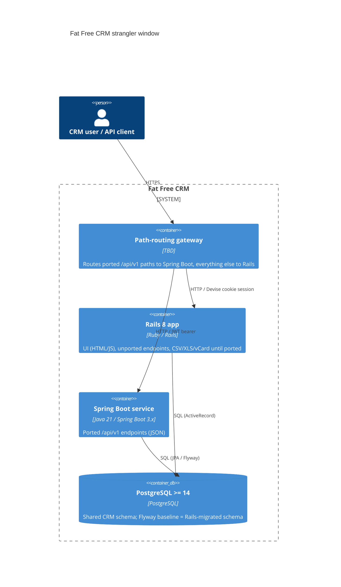

# 0006. ARB submission — Spring Boot strangler service for Fat Free CRM `/api/v1`

- **Status:** Proposed
- **Date:** 2026-10-07
- **ARB ticket:** TO BE CREATED
- **Authors:** Devin (AB-262), on behalf of the AB-261 migration epic
- **Owning team:** TBD — owner to confirm before ARB
- **Related ADRs:** [0001](0001-api-response-format-scope.md), [0002](0002-auth-model-and-ui-ownership.md),
  [0003](0003-custom-field-storage.md), [0004](0004-build-toolchain-and-platform-baselines.md),
  [0005](0005-openapi-compatibility-baseline.md)

## Context

Epic AB-261 migrates the Fat Free CRM JSON API from Rails 8 to Spring Boot using the strangler
pattern: both applications run side by side against the **same** PostgreSQL database behind a
path-routing gateway until cutover. AB-262 (this change) records the Phase 0 decisions in ADRs
0001–0005 and adds read-only schema tooling (`ffcrm:migration:column_census`,
`ffcrm:migration:baseline_dump`) plus a local rehearsal script. The tooling itself only reads an
existing database (or a local throwaway Docker PostgreSQL); it adds no deployed component.

The *decisions* recorded in ADRs 0001–0005, however, commit later phases to architectural changes,
so they are submitted to the ARB together here rather than piecemeal as each implementing ticket
lands.

ARB triggers (from `/arb-review:arb-triage` on this branch, reviewed by hand):

- **T1** — a new deployable service (Spring Boot module in `spring/`, ADR 0004), introduced by later
  tickets (AB-263 onwards), decided here.
- **T4** — a shared schema between two applications for the strangler window; `openapi.yaml`
  frozen as the cross-application contract (ADR 0005); XML/Atom/RSS deprecation (ADR 0001).
- **T6** — a new authentication boundary: stateless JWT access + refresh tokens for `/api/v1`
  alongside Rails Devise cookie sessions, and a path-routing gateway (ADR 0002).
- **T7** — introduces Java 21 / Spring Boot 3.x into a Ruby-only repository (ADR 0004).
- **T2** — data-model change: `cf_*` dynamic columns → one `custom_fields jsonb` column per entity
  table (ADR 0003, additive; final go/no-go after the AB-267 benchmark). No new data store and no
  change of data classification.
- Detector hits rejected as false positives: T2 on Markdown/JSON docs and spec files; T3 on MIT
  licence header URLs and an `example.test` seed value. No new vendor or outbound dependency.

## Decision

We will introduce a Spring Boot 3.x / Java 21 service (`spring/`, package `com.fatfreecrm`) that
progressively takes over `/api/v1` from Rails behind a path-routing gateway, sharing the existing
PostgreSQL (≥ 14) database whose schema is baselined by Flyway from a Rails-migrated dump and only
changed additively (`ddl-auto=validate`); `/api/v1` authenticates with stateless JWT access/refresh
tokens while Rails keeps its cookie sessions and the UI, and compatibility is proven by a
contract-diff harness against the frozen `openapi-baseline-v1` contract.

## Alternatives considered

| Alternative | Pros | Cons | Why rejected |
| --- | --- | --- | --- |
| Do nothing (stay on Rails) | No migration risk or cost | Does not meet the epic's goal of moving the API to the JVM platform | Out of scope of the business ask |
| Big-bang rewrite with separate database and data sync | Clean schema from day one | Long freeze, dual-write/sync infrastructure, high cutover risk | Strangler on one database gives incremental, reversible cutover |
| Shared Devise session for both apps instead of JWT | No new token infrastructure | Couples Spring to Rails session serialisation and cookie secret | Rejected in ADR 0002 |
| EAV table instead of JSONB for custom fields | Portable across databases | N joins per filtered field; breaks single-query authorization + search | Rejected in ADR 0003 |

## Architecture

## Non-functional requirements

| NFR | Target | How met |
| --- | --- | --- |
| Availability SLO | TBD — owner to confirm before ARB | Gateway can route any path back to Rails |
| p95 latency | TBD — no worse than Rails per endpoint (to be measured) | Contract-diff harness + AB-267 benchmark |
| RPO / RTO | Unchanged from today's PostgreSQL backups | Single shared database; no new data store |
| Peak load | TBD — owner to confirm before ARB | — |
| Scaling model | Stateless Spring service, horizontally scalable; database unchanged | JWT keeps the service stateless |
| Data retention | Unchanged | Orphaned `cf_*` data archived before any drop (ADR 0003) |

## Security & compliance

- **Data classification:** unchanged (existing CRM business data incl. contact PII); no new data.
- **Encryption at rest:** unchanged (existing PostgreSQL deployment).
- **Encryption in transit:** TLS terminated at the gateway — TBD, owner to confirm.
- **AuthN / AuthZ:** JWT access + refresh for `/api/v1` (ADR 0002); Rails Devise sessions unchanged;
  authorization denial returns 403 (Rails returns 401 — allow-listed delta); RFC 9457 errors.
- **Secrets:** JWT signing key and DB credentials via the deployment's secret store — TBD.
- **Audit logging:** PaperTrail versions must continue to be written for Spring writes — TBD in the
  write-path tickets.
- **Data residency / regions:** unchanged.
- **Policy sections satisfied:** no infrastructure is added by this change; `policy/approved-infra.yaml`
  is not present in the repo.
- **Threats considered:** token theft (short-lived access tokens + refresh rotation); CORS is
  currently `*` and should be narrowed at the gateway (ADR 0001).

## Cost

| Item | Assumption | Monthly estimate |
| --- | --- | --- |
| Spring Boot service runtime | TBD — depends on hosting platform | TBD |
| Gateway | TBD | TBD |
| **Total** | | TBD — owner to confirm before ARB |

## Operations

- **On-call rotation:** TBD — owner to confirm before ARB.
- **Runbook:** [`../schema-baseline-runbook.md`](../schema-baseline-runbook.md) (schema baseline);
  service runbook TBD in Phase 1.
- **Dashboards / alarms:** TBD in Phase 1.
- **Rollback plan:** re-route the path back to Rails at the gateway; schema changes are additive only,
  so Rails keeps working.
- **Migration / cut-over plan:** [`../migration-plan.md`](../migration-plan.md).

## Policy exceptions requested

| Rule | Resource | Justification | Compensating control | Expiry |
| --- | --- | --- | --- | --- |
| none | | | | |

## Consequences

- Positive: incremental, reversible cutover; one source of truth for data; contract proven per endpoint.
- Negative / risks: two applications writing one schema; custom-field dual-read period; JWT key management.
- Follow-ups: ARB ticket; owning team, NFR numbers and cost to be filled before review.

## Open questions

- Owning team and on-call rotation.
- Availability / latency / load targets and hosting cost.
- Gateway technology and TLS termination.
- Whether the Rails UI survives past cutover (ADR 0002, pending product sign-off).
